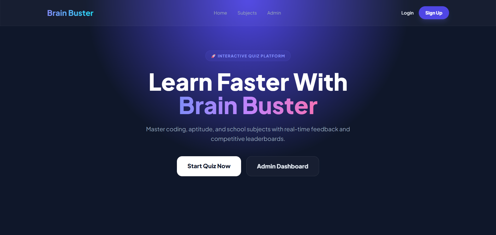
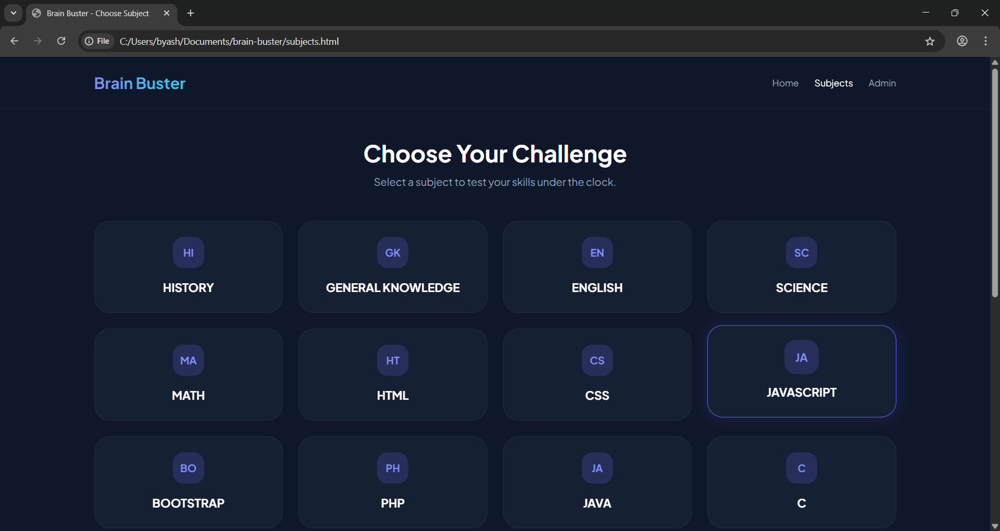
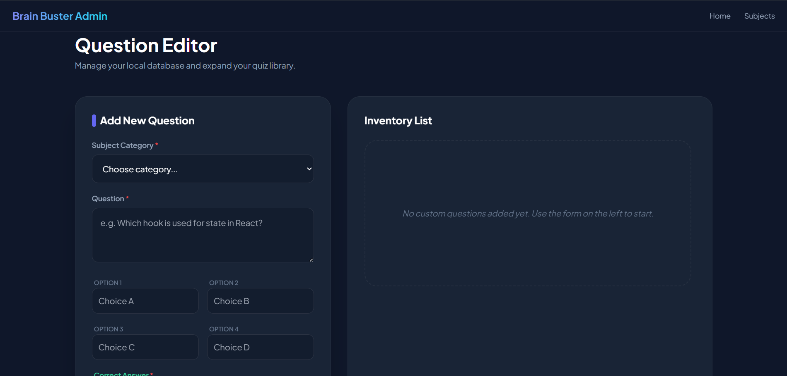

# 🧠 Brain Buster - Ultimate Quiz Arena

[](https://brain-buster-alpha.vercel.app/)
[](https://developer.mozilla.org/en-US/docs/Web/JavaScript)
[](https://tailwindcss.com/)

**Brain Buster** ek high-performance, interactive quiz platform hai jo learning aur self-assessment ko fun banata hai. Isse specifically students aur developers ke liye design kiya gaya hai taaki wo coding, aptitude, aur academic subjects practice kar sakein.

🔗 **Live Demo:** [https://yash24032005.github.io/brain-buster/](https://yash24032005.github.io/brain-buster/)

---

## 📸 Screenshots

<table style="width: 100%;">
  <tr>
    <td style="width: 33%; text-align: center;">
      
      <p><b>🏠 Home UI</b></p>
    </td>
    <td style="width: 33%; text-align: center;">
      
      <p><b>⏱️ Live Quiz</b></p>
    </td>
    <td style="width: 33%; text-align: center;">
      
      <p><b>🛠️ Admin Editor</b></p>
    </td>
  </tr>
</table>

---

## ✨ Key Features

* **🎯 17+ Diverse Categories**: Coding (JS, Python, Java), Aptitude, Science, aur bahut kuch.
* **⏱️ Live Pressure**: Timer-based quizzes jo real-exam environment create karte hain.
* **🌓 Adaptive UI**: Modern Dark/Light mode toggle with **Glassmorphism** effects.
* **🛠️ Admin Control**: User-friendly Admin Panel jahan se naye questions add kiye ja sakte hain.
* **🔐 Auth System**: LocalStorage-based Login/Signup system for personalized tracking.
* **🏆 Hall of Fame**: Dynamic leaderboard jo top performers ko track karta hai.
* **📱 Fully Responsive**: Tailwind CSS ki madad se har device par perfect chalta hai.

---

## 🛠️ Tech Stack

* **Frontend:** HTML5 & Modern JavaScript (ES6+)
* **Styling:** Tailwind CSS (Modern Utility-First Framework)
* **Persistence:** Web Storage API (LocalStorage) for scores, users & custom questions.

---

## ⚙️ Installation & Setup

1. **Repository Clone karein:**
   ```bash
   git clone [https://github.com/Yash24032005/brain-buster.git](https://github.com/Yash24032005/brain-buster.git)
Project Folder mein jayein:

Bash
cd brain-buster
Run Locally:
index.html ko browser mein open karein (VS Code Live Server recommended).

📂 Folder Structure
Plaintext
├── assets/          # Subject images aur static icons
├── screenshots/     # Project UI previews
├── index.html       # Landing Page
├── subjects.html    # Quiz Arena & Category Selection
├── admin.html       # Question Management Dashboard
├── login.html       # User Authentication
├── app.js           # Core Engine (Auth, Quiz Logic, Theme)
└── README.md        # Documentation


👤 Author
Yash Bansal

